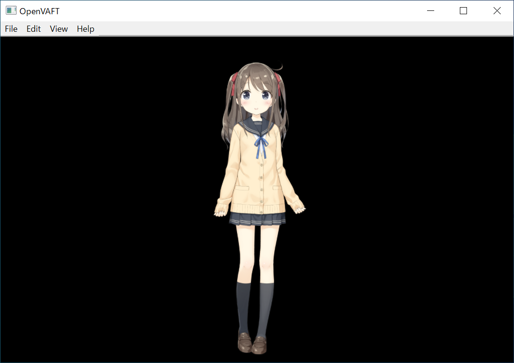

[](https://www.codacy.com/gh/kokarare1212/OpenVAFT/dashboard?utm_source=github.com&amp;utm_medium=referral&amp;utm_content=kokarare1212/OpenVAFT&amp;utm_campaign=Badge_Grade)
# OpenVAFT
Open Source Virtual Avatar Face Tracking<br><br>

## Download
[Click here](https://github.com/kokarare1212/OpenVAFT/releases/latest/) for the latest version.
## Tested Platform
* Windows 10
## Build Requirements
* [CMake](https://cmake.org/download/)
* [Microsoft Visual C++](https://visualstudio.microsoft.com/)
* [Qt6](https://www.qt.io/download-open-source)
* [Cubism SDK for Native](https://www.live2d.com/download/cubism-sdk/download-native/)
* [glew](https://github.com/nigels-com/glew/releases/latest/)
* [OpenCV](https://opencv.org/releases/)
* [shape_predictor_68_face_landmarks.dat](http://dlib.net/files/shape_predictor_68_face_landmarks.dat.bz2)
## Placing Directories
```cmd
lib┬─cubism (Cubism SDK for Native)
   ├─dlib
   ├─glew (glew)
   ├─opencv (OpenCV)
   └─stb
res──shape_predictor_68_face_landmarks.dat
```
## Build
```cmd
git clone https://github.com/kokarare1212/OpenVAFT
cd OpenVAFT
mkdir build
cd build
cmake .. -G Ninja -DCMAKE_BUILDTYPE=Release
cmake --build .
```
